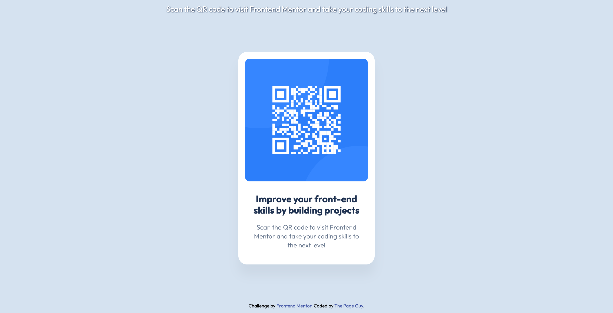

# Frontend Mentor - QR code component solution

This is a solution to the [QR code component challenge on Frontend Mentor](https://www.frontendmentor.io/challenges/qr-code-component-iux_sIO_H). Frontend Mentor challenges help you improve your coding skills by building realistic projects. 

## Table of contents

- [Overview](#overview)
  - [Screenshot](#screenshot)
  - [Links](#links)
- [My process](#my-process)
  - [Built with](#built-with)
  - [What I learned](#what-i-learned)
  - [Continued development](#continued-development)
  - [Useful resources](#useful-resources)
  - [AI Collaboration](#ai-collaboration)
- [Author](#author)
- [Acknowledgments](#acknowledgments)

## Overview

### Screenshot

### Links

- Solution URL: [GitHub](https://github.com/ThePageGuy/qr-code-component)
- Live Site URL: [Demo](https://thepageguy.github.io/qr-code-component/)

## My process

### Built with

- Semantic HTML5 markup
- CSS custom properties
- Flexbox
- Google Fonts

### What I learned

Helped me regain confincedence in my frontend basic.

### Continued development

Maybe fix that in screen of 320px width there is no space around the QR code component.

### Useful resources

- [Unused CSS](https://purifycss.online/) - Helped me reduce the amount of css rules, by removing unused css rules.
- [WCAG QR code Rules](https://www.section508.gov/blog/accessibility-bytes/qr-codes/) - Help me understand what the Alt attribute should be for the QR code image.
- [Validation Service](https://validator.w3.org/#validate_by_input) - Help me check that both my HTML and CSS have correct content

### AI Collaboration

Glad I was able to make this without using it. It help me regain confidence in my knowledge

## Author

- Github - [@ThePageGuy](https://github.com/ThePageGuy)
- Frontend Mentor - [@ThePageGuy](https://www.frontendmentor.io/profile/ThePageGuy)

## Acknowledgments

The Free+ helped by getting the correct measure for all the components, which allow me to have a clear idea of how things should be displayed.